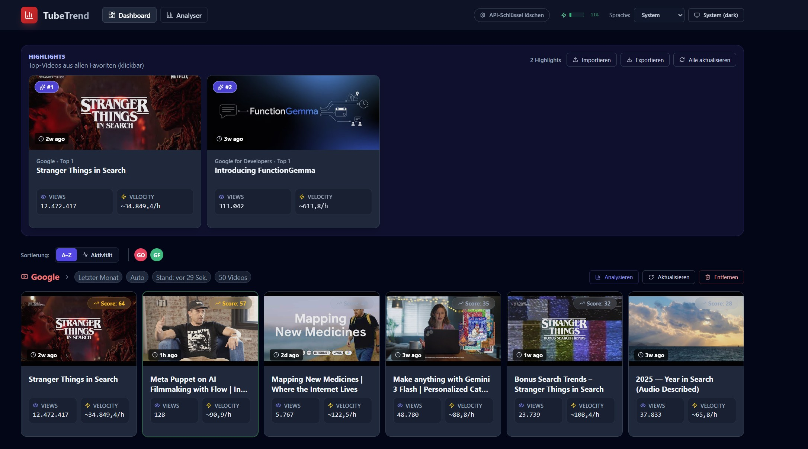
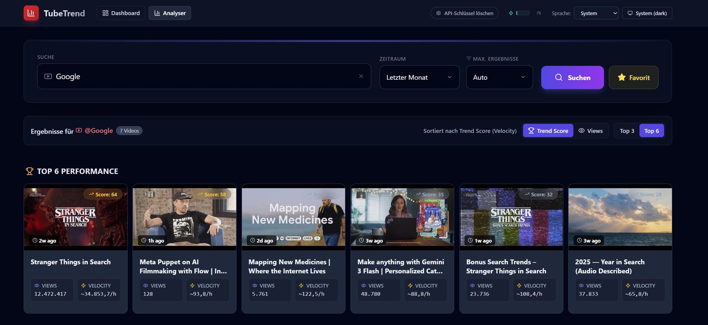

# TubeTrend

A YouTube trend analysis tool built with Vite + React + TypeScript. Analyze video performance, track favorites, and discover trending content across channels.

## Dashboard


## Analyzer


---

## Quick Start

### Option 1: Docker (Recommended)

**One command, no setup required:**

```bash
docker run -d -p 8889:80 ghcr.io/fo0/tubetrend:latest
```

Open http://localhost:8889

### Option 2: Docker Compose

**Linux / macOS:**
```bash
curl -O https://raw.githubusercontent.com/fo0/tubetrend/main/docker-compose.yml && docker-compose up -d
```

**Windows (PowerShell):**
```powershell
Invoke-WebRequest -Uri "https://raw.githubusercontent.com/fo0/tubetrend/main/docker-compose.yml" -OutFile "docker-compose.yml"; docker-compose up -d
```

Open http://localhost:8889

### Option 3: Desktop App (Electron)

**Prerequisites:** Node.js v22+

```bash
git clone https://github.com/fo0/tubetrend.git
cd tubetrend
npm install
npm run electron:dist
```

The packaged app will be in the `release/` directory — portable, no Docker needed.

For a quick preview without packaging:

```bash
npm run electron:preview
```

**Chromebook (ChromeOS / Crostini):** Download the `TubeTrend-*-Chromebook.deb` from [Releases](https://github.com/fo0/tubetrend/releases). This build includes `--no-sandbox` and Wayland auto-detection flags required for Crostini's Linux container. Install via:

```bash
sudo dpkg -i TubeTrend-*-Chromebook.deb
```

### Option 4: Run from Source

**Prerequisites:** Node.js v22+

```bash
git clone https://github.com/fo0/tubetrend.git
cd tubetrend
npm install
npm run dev
```

Open http://localhost:3000

---

## YouTube API Key

The app requires a YouTube Data API v3 key. Get one free at:
https://console.cloud.google.com/apis/credentials

Enter your API key in the app when prompted.

---

## Features

- **Dashboard** — Track favorite channels and keywords with cached video data
- **Analyser** — Search and analyze videos with trend scoring
- **Highlights** — Auto-surface top-performing videos
- **Desktop App** — Portable Electron app for Windows, macOS, and Linux
- **Multi-language** — 13 languages with auto-detection
- **Dark Mode** — System-aware with manual toggle
- **Offline-ready** — All CSS and fonts bundled locally (only YouTube API needs internet)
- **API Quota Tracking** — Monitor YouTube API usage

---

## Build for Production

```bash
npm run build    # Build to dist/
npm run preview  # Preview production build
```

## Tech Stack

React 19 | TypeScript | Vite 6 | Tailwind CSS | i18next | Electron | YouTube Data API v3

## License

MIT
