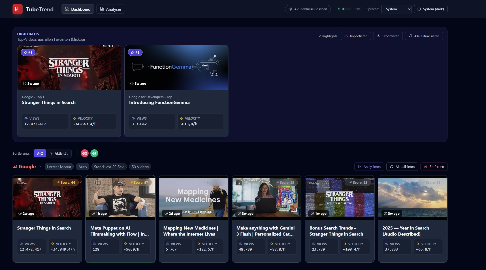
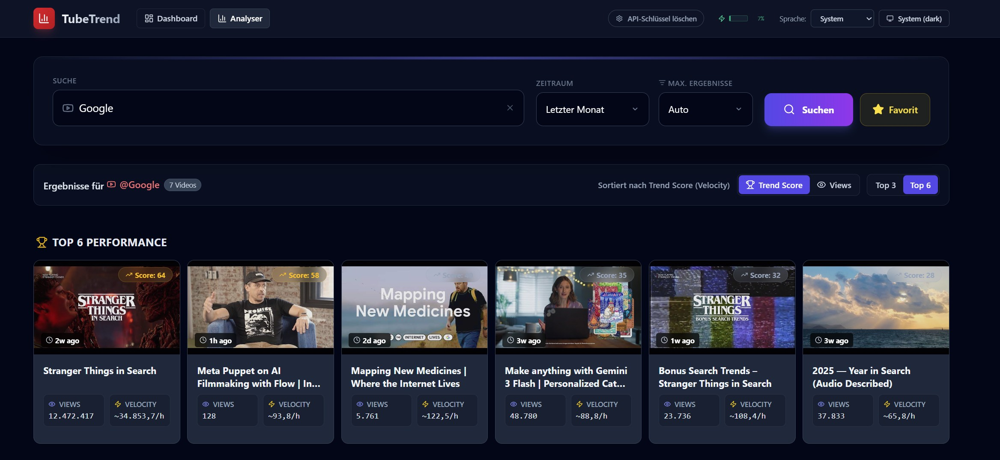

# TubeTrend

A YouTube trend analysis tool built with Vite + React + TypeScript. Analyze video performance, track favorites, and discover trending content across channels.

> **🧩 New: Chrome Extension available!** — Use TubeTrend directly in your browser as a local Chrome Extension. [See setup instructions](#option-5-chrome-extension)

## Dashboard



## Analyzer



---

## Quick Start

### Option 1: Docker (Recommended)

**One command, no setup required:**

```bash
docker run -d -p 8889:80 ghcr.io/fo0/tubetrend:latest
```

Open http://localhost:8889

### Option 2: Docker Compose

**Linux / macOS:**

```bash
curl -O https://raw.githubusercontent.com/fo0/tubetrend/main/docker-compose.yml && docker-compose up -d
```

**Windows (PowerShell):**

```powershell
Invoke-WebRequest -Uri "https://raw.githubusercontent.com/fo0/tubetrend/main/docker-compose.yml" -OutFile "docker-compose.yml"; docker-compose up -d
```

Open http://localhost:8889

### Option 3: Desktop App (Electron)

**Prerequisites:** Node.js v22+

```bash
git clone https://github.com/fo0/tubetrend.git
cd tubetrend
npm install
npm run electron:dist
```

The packaged app will be in the `release/` directory — portable, no Docker needed.

For local development with hot reload:

```bash
npm run electron:dev
```

For a quick preview without packaging:

```bash
npm run electron:preview
```

**Chromebook (ChromeOS / Crostini):** Download the matching `.deb` for your architecture from [Releases](https://github.com/fo0/tubetrend/releases):

- `TubeTrend-*-Chromebook-x64.deb` — Intel/AMD Chromebooks (e.g., ASUS Chromebook CX1, Flip CX5)
- `TubeTrend-*-Chromebook-arm64.deb` — ARM Chromebooks (e.g., ASUS Chromebook CM14, MediaTek models)

These builds include `--no-sandbox` and Wayland auto-detection flags required for Crostini's Linux container. Install via:

```bash
sudo dpkg -i TubeTrend-*-Chromebook-*.deb
```

To build from source:

```bash
npm install
npm run build:chromebook
```

The `.deb` packages will be in `release-chromebook/`.

### Option 4: Android APK (Chromebook / ChromeOS)

**No Linux (Crostini) required — runs natively on ChromeOS via ARCVM.**

Download the `.apk` from [Releases](https://github.com/fo0/tubetrend/releases).

1. On your Chromebook: Settings → Apps → Android → Enable "Unknown sources"
2. Open the downloaded `.apk` file
3. Install and launch from the app launcher

To build from source:

```bash
npm install
npm run cap:build:debug
```

The APK will be in `android/app/build/outputs/apk/debug/`.

### Option 5: Chrome Extension

**Install as a Chrome browser extension:**

```bash
git clone https://github.com/fo0/tubetrend.git
cd tubetrend
npm install
npm run build:extension
```

Then load in Chrome:

1. Open `chrome://extensions/`
2. Enable **Developer mode** (top right)
3. Click **Load unpacked**
4. Select the `dist-extension/` folder

Click the TubeTrend extension icon to open the app in a new tab.

Or download the pre-built ZIP from [Actions artifacts](https://github.com/fo0/tubetrend/actions/workflows/extension-release.yml), extract, and load unpacked.

### Option 6: Run from Source

**Prerequisites:** Node.js v22+

```bash
git clone https://github.com/fo0/tubetrend.git
cd tubetrend
npm install
cp .env.example .env.local   # optional — edit VITE_DEFAULT_SEARCH if desired
npm run dev
```

Open http://localhost:3000

**Available scripts:**

| Command                | Description                       |
| ---------------------- | --------------------------------- |
| `npm run dev`          | Vite dev server (hot reload)      |
| `npm run build`        | Production build to `dist/`       |
| `npm run preview`      | Build + local preview             |
| `npm run typecheck`    | TypeScript type check (no emit)   |
| `npm run format`       | Auto-format with Prettier         |
| `npm run format:check` | Verify formatting (CI-equivalent) |

> **Tests:** No test framework is configured yet. A Vitest setup is planned — see `agent_docs/refactoring_guidelines.md`.

---

## YouTube API Key

The app requires a YouTube Data API v3 key. Get one free at:
https://console.cloud.google.com/apis/credentials

Enter your API key in the app when prompted.

---

## Features

- **Dashboard** — Track favorite channels and keywords with cached video data
- **Analyser** — Search and analyze videos with trend scoring
- **Highlights** — Auto-surface top-performing videos
- **Desktop App** — Portable Electron app for Windows, macOS, and Linux
- **Chrome Extension** — Install as browser extension, opens in a new tab
- **Multi-language** — 13 languages with auto-detection
- **Dark Mode** — System-aware with manual toggle
- **Offline-ready** — All CSS and fonts bundled locally (only YouTube API needs internet)
- **API Quota Tracking** — Monitor YouTube API usage

---

## Build for Production

```bash
npm run build    # Build to dist/
npm run preview  # Preview production build
```

## Tech Stack

React 19 | TypeScript | Vite 8 | Tailwind CSS 4 | i18next | Electron | YouTube Data API v3

## License

MIT
